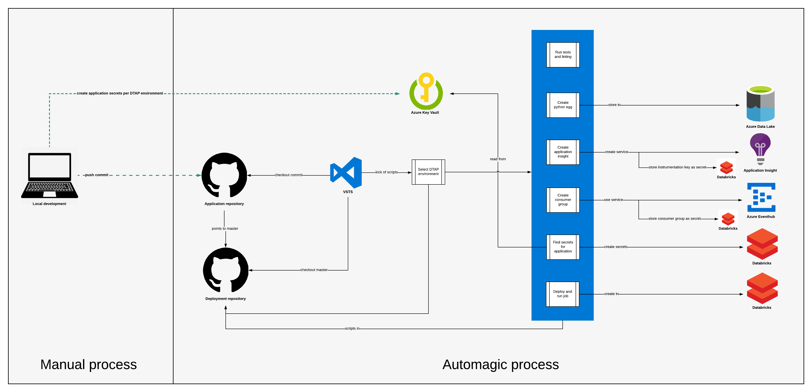

# Pyspark streaming deployment

What does it do?



# Setting it up
This package is used as dependency in other project to consolidate deployment and testing in pyspark streaming applications (though batch applications are also supported)

To use this package for deployment simply add the following to your `setup.py`
```
extras_require={
    'deploy': [
        'pyspark-streaming-deployment==1.0'
    ]
},
dependency_links=[
    "git+https://{}@github.com/Schiphol-Hub/pyspark-streaming-deployment.git"
    "@master"
    "#egg=pyspark-streaming-deployment-1.0".format(os.environ['GITHUB_TOKEN'])
]
```
To finish setting up CI/CD VSTS must have a `GITHUB_TOKEN` passed to the docker-compose script containing a github token that has access to [https://github.com/Schiphol-Hub/](https://github.com/Schiphol-Hub/). This token is already available in VSTS;

1. Edit your build definition and navigate to `Variables`
2. Hit `Variable groups` and `Link variable group`
3. Choose `github` and save your definition

In your `.vsts-ci.yaml` you can use these steps and docker commands to (choose any of the following that are applicable to your application):

* Run linting

    To customise linting copy-paste the `.flake8` file to the root of your project, otherwise the defaults are ran (which you most likely don't want)
    ```
    - task: DockerCompose@0
      displayName: Run python linting
      inputs:
        dockerComposeCommand: |
          run --rm pyspark bash -c "pip install --process-dependency-links .[deploy] && run_linting"
    ```
* Run tests

    To customise code coverage settings copy-paste the `.coveragerc` file to the root of your project, otherwise the defaults are ran (which you most likely don't want)
    ```
    - task: DockerCompose@0
      displayName: Run python tests
      inputs:
        dockerComposeCommand: |
          run --rm pyspark bash -c "pip install --process-dependency-links .[deploy] && run_tests"
    ```

* Publish test results
    In order for VSTS to nicely display your test results, you need to publish the results of the tests (which is different than the results of the coverage). Obviously, your tests need to have run before you can publish the results.
    ```
    - task: PublishTestResults@2
      inputs:
        testResultsFiles: $(System.DefaultWorkingDirectory)/testresults.xml
    ```

* Publish code coverage
    In order to get your coverage picked up by VSTS, you need to 'publish' the results. This task should only be run after the tests have been (successfully) run and the coverage results are available.
    ```
    - task: PublishCodeCoverageResults@1
      displayName: 'Publish coverage results'
      inputs:
        codeCoverageTool: 'cobertura'
        summaryFileLocation: $(System.DefaultWorkingDirectory)/coverage.xml
        reportDirectory: $(System.DefaultWorkingDirectory)/htmlcov
        failIfCoverageEmpty: true
    ```

* Upload artifact to ADLS
    ```
    - task: DockerCompose@0
      displayName: Build egg
      inputs:
        dockerComposeCommand: |
          run --rm python python setup.py bdist_egg
    - task: DockerCompose@0
      displayName: Upload artifact to ADLS
      inputs:
        dockerComposeCommand: |
          run --rm python bash -c "pip install --process-dependency-links .[deploy] && deploy_to_adls"
      env:
        AZURE_SP_USERNAME: $(azure_sp_username)
        AZURE_SP_PASSWORD: $(azure_sp_password)
        AZURE_SP_TENANTID: $(azure_sp_tenantid)
        AZURE_ADLS_NAME: $(azure_adls_name)
    ```
    
* Deploy the application to databricks
    ```
    - task: DockerCompose@0
      displayName: Deploy app to databricks
      inputs:
        dockerComposeCommand: |
          run --rm python bash -c "pip install --process-dependency-links .[deploy] && deploy_to_databricks"
      env:
        AZURE_DATABRICKS_HOST: ${azure_databricks_host}
        AZURE_DATABRICKS_TOKEN_DEV: ${azure_databricks_token_dev}
        AZURE_DATABRICKS_TOKEN_ACP: ${azure_databricks_token_acp}
        AZURE_DATABRICKS_TOKEN_PRD: ${azure_databricks_token_prd}
    ```
    
* Create databricks secrets
    
    The secrets are pulled from Azure Key Vault. The keys in the vault should be prefixed with you application name (which is the repo name) so that the script can find the relevant keys for your application.
    The secrets in databricks are created without the prefix, but in a separate `scope` (which is the repo name again).
    ```
    - task: DockerCompose@0
      displayName: Create databricks secrets
      inputs:
        dockerComposeCommand: |
          run --rm python bash -c "pip install --process-dependency-links .[deploy] && create_databricks_secrets"
      env:
        AZURE_DATABRICKS_HOST: ${azure_databricks_host}
        AZURE_DATABRICKS_TOKEN_DEV: ${azure_databricks_token_dev}
        AZURE_DATABRICKS_TOKEN_ACP: ${azure_databricks_token_acp}
        AZURE_DATABRICKS_TOKEN_PRD: ${azure_databricks_token_prd}
    ```
    
* Create an application insights

    Add the following task to the .vsts-ci.yaml to create an application insights automagically.
    ```
    - task: DockerCompose@0
      displayName: Create application insights
      inputs:
        dockerComposeCommand: |
          run --rm python bash -c "pip install --process-dependency-links .[deploy] && create_application_insights"
      env:
        AZURE_DATABRICKS_HOST: ${azure_databricks_host}
        AZURE_DATABRICKS_TOKEN_DEV: ${azure_databricks_token_dev}
        AZURE_DATABRICKS_TOKEN_ACP: ${azure_databricks_token_acp}
        AZURE_DATABRICKS_TOKEN_PRD: ${azure_databricks_token_prd}
        AZURE_USERNAME_DEV: ${azure_username_dev}
        AZURE_PASSWORD_DEV: ${azure_password_dev}
        AZURE_USERNAME_ACP: ${azure_username_acp}
        AZURE_PASSWORD_ACP: ${azure_password_acp}
        AZURE_USERNAME_PRD: ${azure_username_prd}
        AZURE_PASSWORD_PRD: ${azure_password_prd}
        SUBSCRIPTION_ID: ${SUBSCRIPTION_ID}
        GITHUB_TOKEN: ${github_token}
    ```
    This will inject a databricks secret called `instrumentation-key` which you can use to set up a [streaming query listener](https://github.com/Schiphol-Hub/streaming-query-listener).
    
The VSTS variables for uploading, deploying and secrets are, just like the `github` variable, available as `Variable groups`. Follow the above steps to get them in your build.

* Create consumer groups in eventhub
    You must specify which eventhubs to create which consumer groups in. Make sure you prefix them correctly with the application name.
    ```
    - task: DockerCompose@0
      displayName: Create Eventhub consumer groups
      inputs:
        dockerComposeCommand: |
          run --rm python bash -c "pip install --process-dependency-links .[deploy] && create_eventhub_consumer_groups"
      env:
        EVENTHUB_CONSUMER_GROUPS: 'hub1:your-app-name-group1,hub1:your-app-name-group2,hub2:your-app-name-group1'
        AZURE_DATABRICKS_HOST: ${azure_databricks_host}
        AZURE_DATABRICKS_TOKEN_DEV: ${azure_databricks_token_dev}
        AZURE_DATABRICKS_TOKEN_ACP: ${azure_databricks_token_acp}
        AZURE_DATABRICKS_TOKEN_PRD: ${azure_databricks_token_prd}
        AZURE_USERNAME_DEV: ${azure_username_dev}
        AZURE_PASSWORD_DEV: ${azure_password_dev}
        AZURE_USERNAME_ACP: ${azure_username_acp}
        AZURE_PASSWORD_ACP: ${azure_password_acp}
        AZURE_USERNAME_PRD: ${azure_username_prd}
        AZURE_PASSWORD_PRD: ${azure_password_prd}
        SUBSCRIPTION_ID: ${subscription_id}
        GITHUB_TOKEN: ${github_token}
    ```
    The above settings will create databricks secrets in scope `your-app-name` with name `hub1-connection-string` and `hub2-connection-string`

# Local development

Make sure you have installed and updated docker

Run linting and tests with:

```bash
docker-compose run --rm python bash -c "pip install -e .[lint] && flake8"
docker-compose run --rm python bash -c "pip install -e .[test] && pytest tests"
```
